# 🌱️ 무럭무럭

- 식물의 정보 공유, 관련 상품 판매, 관리 기능 등을 제공하는 식물을 위한 멀티 서비스
- 2023.05.22(월) ~ 2023.06.15(목), 이 후 디벨롭할 예정

<p align="center">
    
</p>

<details>
<summary>프로젝트 환경 설정 가이드</summary>
<div markdown="1">

1. 가상환경 생성

```bash
$ python -m venv venv
```

2. 가상환경 활성화

```bash
# 윈도우
$ . venv/Scripts/activate

# Mac
$ . venv/bin/activate
```

3. 패키지 설치

```bash
$ pip install -r requirements.txt
```

4. 마이그레이션 진행

```bash
$ python manage.py makemigrations
$ python manage.py migrate
```

5. 로컬에서 프로젝트 열기

```bash
$ python manage.py runserver
```

</div>
</details>

<br>
<br>

## Team | 꽃을 든 남자

### Members

|                                     [한원태](https://github.com/dnjsxo0616)                                      |                                    [이원일](https://github.com/illson97)                                     |                                      [홍순혁](https://github.com/Sunhyeok11)                                      |                                      [조정곤](https://github.com/JeonggonCho)                                      |
|:-------------------------------------------------------------------------------------------------------------:|:---------------------------------------------------------------------------------------------------------------:|:----------------------------------------------------------------------------------------------------------:|:---------------------------------------------------------------------------------------------------------------:|
| [](https://github.com/dnjsxo0616) | [](https://github.com/illson97) | [](https://github.com/Sunhyeok11) | [](https://github.com/JeonggonCho) |
|                                                  조장<br/>백엔드                                                   |                                                       백엔드                                                       |                                                    백엔드                                                     |                                                프론트엔드<br/>프로젝트 발표                                                |

<br>
<br>

## 1. 프로젝트 소개

### 개요

- 반려동물만큼 `반려식물`에 대한 관심이 높아지고 있다. SNS의 `#반려식물의 해시태그` 검색 결과가 `76만`개에 달할 정도이며 많은 사람들이 반려식물을 키움으로써 `우울감 및 외로움을 해소`하는데 도움이 되었다고 답변하였다.
- 따라서 식물의 `정보수집`, `커뮤니티`, 관련 `상품 구매`, `식물관리` 등 식물에 대한 종합적인 서비스를 제공하는 플랫폼을 계획하게 되었다.

<p align="center">
  
</p>

[카카오뱅크 - 사람들이 갑자기 식물에 열광하는 이유](https://event.kakaobank.com/p/contents?i=45)

<br>
<br>

## 2. Commit Conventions

<br>
<br>

## 3. 프로젝트 관리

- Jira의 칸반보드를 통해 `프론트엔드 할 일`, `백엔드 할 일`, `진행 중`, `완료`로 업무 스테이지를 분기 처리하여 협업을 진행함

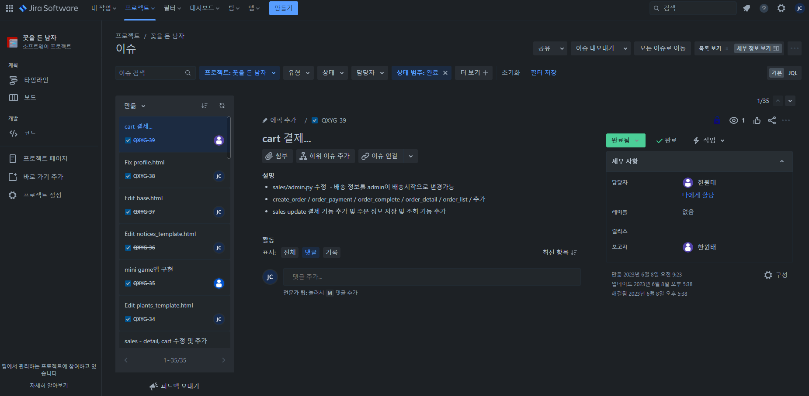

<Jira 완료된 이슈보기>

[Jira 프로젝트 관리 링크](https://illson97.atlassian.net/jira/software/projects/QXYG/boards/1)

<br>
<br>

## 4. 주요 기능


<br>
<br>

## 5. 역할

### ‍👨‍💻 한원태

<br>

### 👨‍💻 조정곤

<br>

### 👨‍💻 이정일

<br>

### 👨‍💻 홍순혁

<br>
<br>

## 6. 개발 환경

### Frontend

### Backend

### 협업툴

### Deployment

<br>
<br>

## 7. ERD 모델 설계

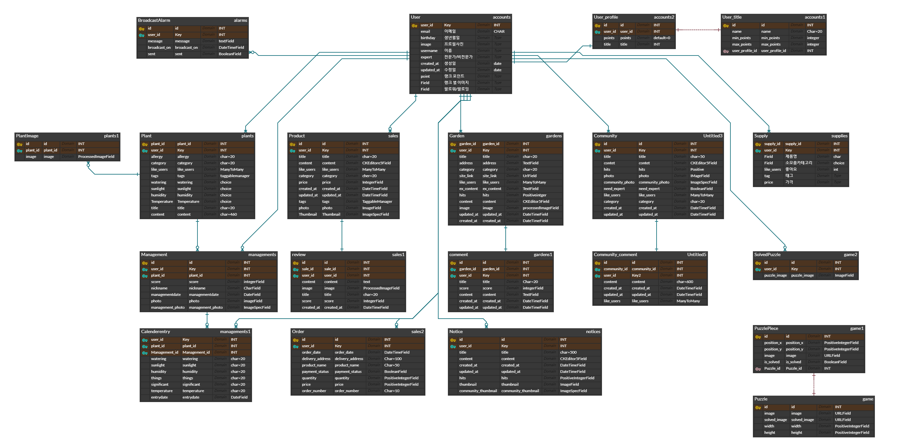

[무럭무럭 - ERD 작성 링크](https://www.erdcloud.com/d/qwgeSmxPxhfiWMjnu)

<br>
<br>

## 8. 디자인

### 목업

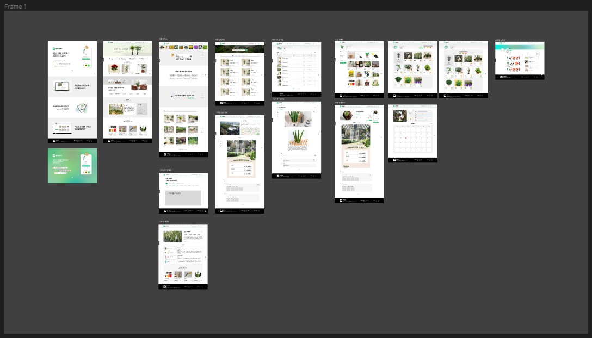

[무럭무럭 - Figma 목업 제작](https://www.figma.com/file/hsPJQHPx2Sn80i4Q4Zqvka/4%EC%A1%B0?type=design&node-id=0-1&mode=design&t=WdP5t5Ehv1Tk0dIk-0)

<br>
<br>

## 9. 프로젝트 구조

<details>
<summary>프로젝트 구조 트리 보기(클릭)</summary>
<div markdown="1">

```
MureokMureok
 │
 ├─ accounts
 │ ├─ templates
 │ │ └─ accounts
 │ │   ├─ change_password.html
 │ │   ├─ login.html
 │ │   ├─ profile.html
 │ │   ├─ signup.html
 │ │   └─ update.html
 │ ├─ forms.py
 │ ├─ models.py
 │ ├─ urls.py
 │ └─ views.py
 │
 ├─ alarms
 │ ├─ admin.py
 │ ├─ apps.py
 │ ├─ consumers.py
 │ ├─ models.py
 │ ├─ routing.py
 │ ├─ tasks.py
 │ ├─ tests.py
 │ └─ views.py
 │
 ├─ communities
 │ ├─ templates
 │ │ └─ communities
 │ │   ├─ create.html
 │ │   ├─ detail.html
 │ │   ├─ index.html
 │ │   └─ update.html
 │ ├─ forms.py
 │ ├─ models.py
 │ ├─ urls.py
 │ └─ views.py
 │
 ├─ game
 │ ├─ templates
 │ │ └─ game
 │ │   ├─ index.html
 │ │   ├─ play_puzzle.html
 │ │   └─ solved_puzzles.html
 │ ├─ forms.py
 │ ├─ models.py
 │ ├─ serializers.py
 │ ├─ urls.py
 │ └─ views.py
 │
 ├─ gardens
 │ ├─ templates
 │ │ └─ gardens
 │ │   ├─ create.html
 │ │   ├─ detail.html
 │ │   ├─ index.html
 │ │   ├─ listing.html
 │ │   ├─ search.html
 │ │   └─ update.html
 │ ├─ forms.py
 │ ├─ models.py
 │ ├─ urls.py
 │ └─ views.py
 │
 ├─ managements
 │ ├─ templates
 │ │ └─ managements
 │ │   ├─ create.html
 │ │   ├─ detail.html
 │ │   ├─ index.html
 │ │   └─ update.html
 │ ├─ forms.py
 │ ├─ models.py
 │ ├─ urls.py
 │ └─ views.py
 │
 ├─ mureok
 │ ├─ asgi.py
 │ ├─ celery.py
 │ ├─ custom_context_processors.py
 │ ├─ settings.py
 │ ├─ urls.py
 │ ├─ views.py
 │ └─ wsgi.py
 │
 ├─ notices
 │ ├─ templates
 │ │ └─ notices
 │ │   ├─ create.html
 │ │   ├─ detail.html
 │ │   ├─ index.html
 │ │   └─ update.html
 │ ├─ forms.py
 │ ├─ models.py
 │ ├─ urls.py
 │ └─ views.py
 │
 ├─ plants
 │ ├─ templates
 │ │ └─ plants
 │ │   ├─ category.html
 │ │   ├─ create.html
 │ │   ├─ detail.html
 │ │   ├─ filter.html
 │ │   ├─ index.html
 │ │   ├─ recommendation.html
 │ │   ├─ search.html
 │ │   └─ update.html
 │ ├─ forms.py
 │ ├─ models.py
 │ ├─ urls.py
 │ └─ views.py
 │
 ├─ sales
 │ ├─ templates
 │ │ └─ sales
 │ │   ├─ cart.html
 │ │   ├─ create.html
 │ │   ├─ create_order.html
 │ │   ├─ create_ordernow.html
 │ │   ├─ detail.html
 │ │   ├─ filter.html
 │ │   ├─ index.html
 │ │   ├─ order_complete.html
 │ │   ├─ order_detail.html
 │ │   ├─ order_list.html
 │ │   ├─ order_payment.html
 │ │   └─ update.html
 │ ├─ forms.py
 │ ├─ models.py
 │ ├─ urls.py
 │ └─ views.py
 │
 ├─ templates
 │ ├─ base.html
 │ ├─ home.html
 │ ├─ main.html
 │ └─ search.html
 │
 ├─ db.sqlite3
 │
 └─ requirements.txt
```

</div>
</details>

<br>
<br>

## 10. URL 및 View 설계

<br>
<br>

## 11. 서비스 화면

### 인덱스

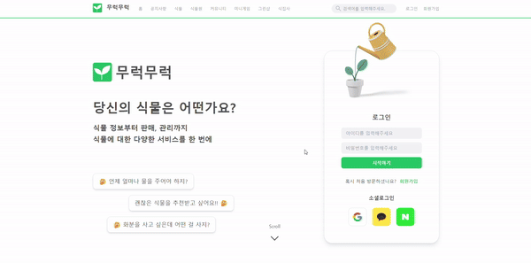

<details>
<summary>인덱스 모바일(클릭)</summary>
<div markdown="1">


</div>
</details>

- 플랫폼 회원가입 및 로그인 가능
- 플랫폼 기능 소개

<br>

### 홈

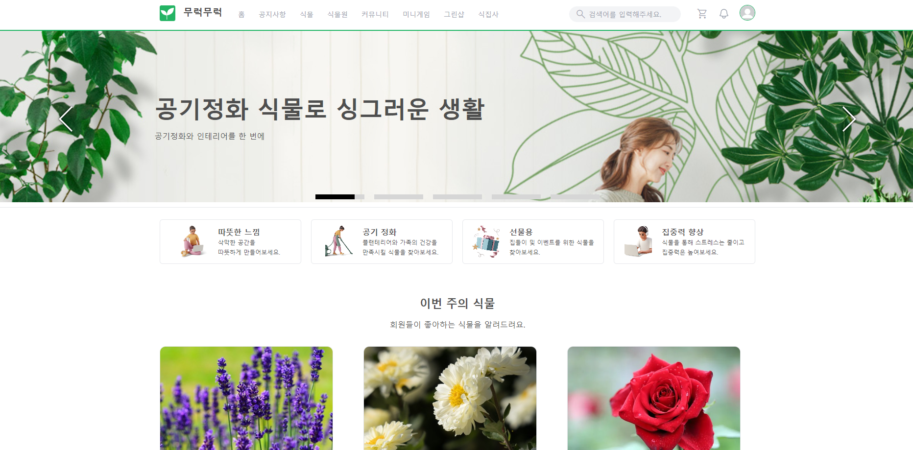

<details>
<summary>홈 모바일(클릭)</summary>
<div markdown="1">

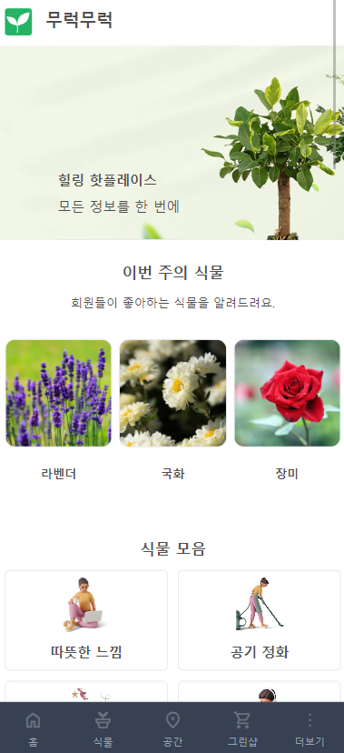

</div>
</details>

- GNB 표시
- 캐로젤 및 다양한 주제별 항목 표시

<br>

### 식물


<details>
<summary>식물 모바일(클릭)</summary>
<div markdown="1">


</div>
</details>

- 식물에 대한 일반 검색, 태그 검색, 순위, 리스트 표시

<br>

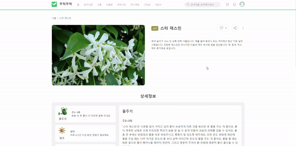

<details>
<summary>식물 디테일 모바일(클릭)</summary>
<div markdown="1">


</div>
</details>

- 식물의 이미지와 간략한 정보를 볼 수 있음
- 좋아요 및 공유 가능
- 상세정보의 탭을 통해 해당 식물의 적정 물주기, 일조, 습도, 온도에 관한 정보 제공
- 관리에 도움이 되는 상품 추천

<br>

### 식물원


<details>
<summary>식물원 모바일(클릭)</summary>
<div markdown="1">


</div>
</details>

- 식물원에 대한 일반 검색, 카테고리, 리스트 표시

<br>

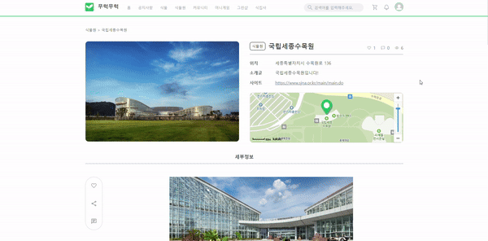

<details>
<summary>식물원 디테일 모바일(클릭)</summary>
<div markdown="1">


</div>
</details>

- 식물원의 이미지 및 주소, 홈페이지, 상세 정보 제공
- 지도 정보 제공
- 좋아요, 공유 가능
- 후기 작성 가능

<br>

### 커뮤니티

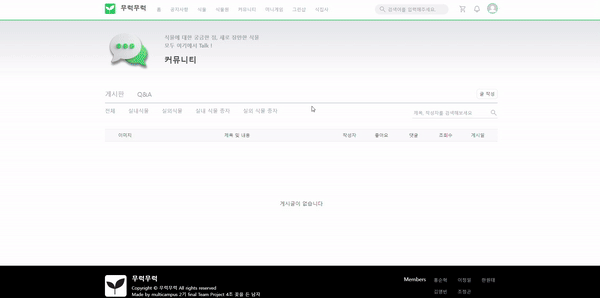

<details>
<summary>커뮤니티 모바일(클릭)</summary>
<div markdown="1">

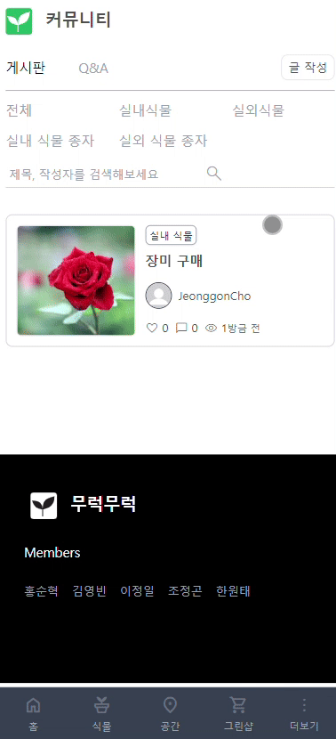

</div>
</details>

- 게시글 작성 및 Q&A 작성 가능
- 이미지 첨부 가능

<br>

### 미니게임

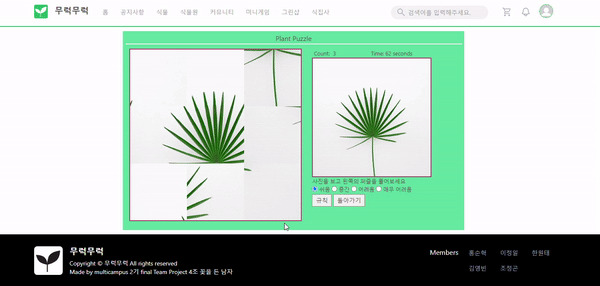

- 간단한 식물 퍼즐게임 제공
- 매회 랜덤한 식물 이미지 제공
- 난이도 조절이 가능하며, 난이도에 따라 퍼즐 조각 개수가 달라짐
- 맞추기 성공 시, 걸린 시간 표시

<br>

### 그린샵

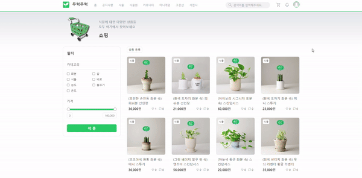

<details>
<summary>그린샵 모바일(클릭)</summary>
<div markdown="1">


</div>
</details>

- 식물 및 식물 관리 상품 판매
- 카테고리 및 가격을 통한 필터링 가능

<br>


<details>
<summary>그린샵 디테일 모바일(클릭)</summary>
<div markdown="1">


</div>
</details>

- 그린샵 상품 구매 가능
- 장바구니 기능 제공

<br>

### 식집사


<br>

### 프로필


<br>

### 검색

<br>
<br>

## 12. 이슈

### 패키지간 버전 충돌 문제

<br>
<br>

## 13. 회고

- `한원태` : 계속해서 아이디어를 공유하고 도전해보는 점이 너무 좋았고, 서로 도우며 협업하는 것이 긍정적인 자극이 되었다. 좋은 팀원분들을 만나서 프로젝트 기획부터 끝까지 좋은 분위기로 마무리해서 모두에게 감사하고 힘이 되었다.


- `조정곤` : 프로젝트 기간이 길었던만큼 새로운 기술을 적용해본 것과 더불어 화면반응형까지 구현한 점이 가장 좋았습니다. 다만 프론트엔드 역할에서 해야할 일들이 많아 팀원분들의 문제에 적극적으로 도움을 못드렸던 부분이 아쉽습니다.


- `이정일` : 한 달이라는 시간동안 정말 재미있었습니다. 프로젝트 구상부터 마무리까지 팀원분들께 많이 배웠습니다. 마감 기한으로 더 디테일한 구현은 힘들었지만 좋은 결과물을 만든 것 같아 뿌듯합니다.


- `홍순혁` : 많은 걱정도 있었지만, 팀원분들 덕분에 유익한 한 달을 보낸 것 같습니다.